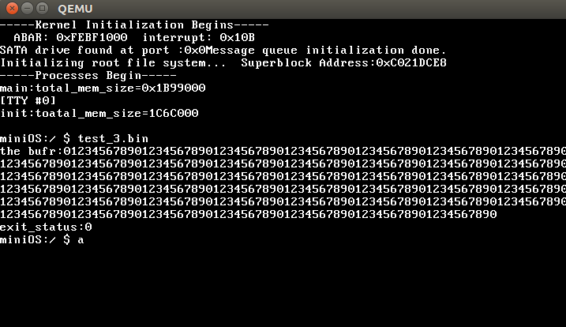

# 前言

下文过度陈旧，但是没时间更新，这里只提下 v2.0.0.alpha.1 之后重要的几点。

**什么样**

- `doc/` 文档
- `assets/` 文档中的图片资源以及其他的一些系统无关资源
- `project/` 构建系统
- `scripts/` 跟项目整体沾边的脚本都在这
- `share/` 共享资源，目前只有供 gdb 使用的文件
- `tools/` 宿主机工具
- `include/` 各模块头文件
- `generic/` 目标系统的通用代码片段，通常仅为头文件，默认链接
- `user/` 用户程序，install 时默认按相对路径挂载
- `test/` 测例程序，是特殊的用户程序
- `arch/<arch>/` 架构相关代码，可以简单视作构建时与对应模块目录平级混合
- `*/` 各模块的架构无关源码
- `build/` 生成文件的目录（你得先构建才能看到它）
- `build/<arch>/` 对应配置架构的生成文件的目录，原则是凡是架构相关的生成内容都在这

**怎么用**

打开 `minios.preset`，里面中括号括起来的部分是你可以使用的预设。

其中一个预设是 `i386`，指定了“构建 arch-x86 的 32 位架构 i386 的以 fat32 为 bootfs 和 rootfs 的 bootloader 类型为 mbr 分区的硬盘系统镜像”。

假设你想要得到的确实是它，那么构建装载仿真一条龙如下：

```shell
make preset=i386 build install sim target=mbr
```

若仿真时需要启用 gdb，使用 sim 目标时追加 `debug=on` 即可。

preset 加载从预设文件中加载预设，这里面包含了一些构建系统所要求的必要参数，错误的参数输入将会被拒绝参与构建。

build 仅构建几乎所有输出目标，包括 stripped binaries 与 debugging files。

install 仅装载相关目标到系统镜像，镜像仅在必要时自动生成，如尚不存在或 bootloader 及 kernel 存在更新。

sim 仅挂载系统镜像并仿真运行，它并不在乎镜像是否完整。

其中 target 指定了 sim 挂载当前架构的何种镜像，此处 mbr 指定了使用 i386 预设的架构对应的 mbr 分区格式硬盘的系统镜像，若对应格式的镜像并未被指定构建或在当前架构不支持，你会得到一个错误提示。

对于更多信息，请 `make help`。

> help 及其他一些命令由于不依赖于输入参数或不影响环境/构建，所以被容许从旁路绕过构建系统检查。

**怎么改**

构建系统极其复杂且特立独行，如果不是出于学习目的或纯粹愿意下精力研究，建议别看。事实上，你几乎无法再碰到什么情况会让你产生哪怕是微调构建过程的需求，甚至你可能难以找到当前项目中的一些具体事务在构建系统的哪里得到体现——它足够泛用了。

其次，如果你只是想改改某些参数，更别动 \*.mk！那里提供了一套相对可靠的默认参数，如果需要更改，请在 make 程序中传参或通过编辑自己的 preset 实现。

代码修改指示：

- ipc fs driver 等独立模块请进对应目录开发
- 关于内核的修改请进 kernel
- 并非内核必要组件，而仅仅是被内核需要的通用性代码请往 klib 写，例如 kernel 需要个加密方法并且出于权限等方面考虑，只能在内核中运行，亦或者该方法几乎只对内核实现有意义，而用户态程序根本不会在乎这个东东——对于这类片段，请进 klib，类比情形 ulib 同理
- 若代码片段同时符合 klib ulib 的要求，请往 generic 写
- 除了 private 的头文件放在源码同目录或相对子目录，其他头文件请往 include 的对应模块的目录放
- 对于 tools user test 等模块，每个不纯的文件夹都指代一个同名的程序——此处指文件夹存在一般文件，对应的，空文件夹或仅包含子目录的文件夹被视为路径的一部分而非单个程序——tools 是特例，只有顶层文件夹被视为一个宿主机程序的指代

在以上的基础上，如何编写具体代码请随意。

# MiniOS简介
---
MiniOS是一个面向操作系统开发学习者的、微型的操作系统内核，可以运行在32位x86架构的CPU上。MiniOS专注于对操作系统开发中的核心概念和基础原理的学习与研究，并基于通用硬件对操作系统中的各基本子系统或模块进行实现。
流行的[Linux](https://github.com/torvalds/linux)、 [FreeBSD](https://github.com/freebsd/freebsd) 等操作系统内核固然很好，然而它们却并不适合内核开发的初学者。一方面，这些操作系统内核已经发展了很多年，积累了十分庞大的代码量（发布于2005年的Linux内核早期版本v2.6.12就已经有大约400万行代码），另一方面，因为应用在生产环境中的需要，这些内核代码中包含了大量和操作系统基本原理无关的细节，初学者很难抓到其中的要领。因此，从一个简单的、代码量较少的操作系统内核入手，使用较短的时间熟悉并掌握操作系统内核开发领域的核心概念和基础原理，等把这些基础性知识掌握到一定程度，再投身于Linux等实用内核的开发，对于内核初学者来说是一个比较现实可行的策略。即使不打算从事内核开发，通过一个易于入手的内核学习一些操作系统相关的基础知识，也会有利于写出更健壮、性能更好的应用程序。
查看MiniOS的[release_notes](https://github.com/doubleXnine/MiniOS/blob/master/release_notes.txt) 可了解MiniOS的当前开发进展。

# MiniOS开发工具
---
MiniOS主要基于C语言和x86汇编语言开发，使用的开发工具包括：

* 汇编器[nasm](https://www.nasm.us/)
* C语言编译器gcc
* GNU二进制工具集[Binutils](http://www.gnu.org/software/binutils/)
* 项目构建工具make
* 调试器gdb

其中，Binutils是一套对二进制文件进行操作的工具集，包括创建静态库的工具ar，从二进制文件中去除符号表以减小文件体积的工具strip等。

# 运行MiniOS的方法
---
MiniOS当前从软盘中启动，启动流程为：
1. BIOS自检完毕后从软盘引导扇区中加载引导程序（boot.bin）至内存，并将控制权交给引导程序。
2. 引导程序从软盘中读取加载器（loader.bin）至内存，并将控制器交给加载器。
3. 加载器运行时会从软盘中读取MiniOS内核（kernel.bin）至内存，然后从CPU的实模式进入保护模式，并将控制权交给内核。
4. MiniOS开始运行。

由于MiniOS是一个面向学习者的操作系统内核，因此目前主要运行在虚拟机中，可选的虚拟机有[Bochs](http://bochs.sourceforge.net/)和[Qemu](https://www.qemu.org/)。

**在Bochs中运行MiniOS**
1. 安装Bochs，在Ubuntu系统下可以直接执行命令`sudo apt-get install bochs`进行安装，也可以先下载Bochs的源码再进行编译安装，通过源码进行安装可以选择想要的Bochs版本。
2. 进入MiniOS源目录，执行`tar zxvf misc/80m.img.tar.gz .`，从硬盘镜像压缩包中解压出硬盘镜像。
3. 在当前目录下执行`bochs`命令启动Bochs虚拟机，Bochs首先会从bochsrc文件中读取配置信息，然后对Bochs给出的运行提示信息进行确认便可让MiniOS在Bochs内运行。

**在Qemu中运行MiniOS**
1. 按照Qemu，在Ubuntu系统下可以直接执行命令`sudo apt-get install qemu-system-x86`进行按照，也可以下载Qemu的源代码进行编译安装。
2. 进入MiniOS源目录，执行`tar zxvf misc/80m.img.tar.gz .`，从硬盘镜像压缩包中解压出硬盘镜像。
3. 在当前目录下执行`./launch-qemu.sh`命令启动Qemu虚拟机，之后MiniOS将直接在Qemu内开始运行。Qemu虚拟机没有使用像bochsrc一样的配置文件，配置信息是通过命令行选项指定的，脚本launch-qemu.sh中包含了当前使用的配置选项。

# 调试MiniOS
通过使用Bochs或Qemu中自带的调试功能可以对MiniOS进行汇编语言级的调试，但由于汇编程序比较冗长且难以阅读，这种调试方式使用起来不太方便。幸运的是，Bochs和Qemu中都内置了gdb支持，通过和gdb提供的远程调试功能配合，可以对MiniOS进行C源码级的调试。

**使用Bochs+gdb调试MiniOS**
1. 从源代码编译安装Bochs，并在编译时打开gdb支持选项。然后在Bochs配置文件中添加gdb配置信息，MiniOS源目录下的bochsrc-gdb文件中已经包含了所需的配置选项。
2. 在MiniOS源目录下执行`./launch-bochs-gdb.sh`，所运行的shell脚本会在一个新的终端窗口中运行gdb，并加载debug版的内核二进制文件。
3. 在gdb命令界面执行命令`target remote :2345`和Bochs建立连接。
4. 用gdb像调试本地程序一样对MiniOS进行调试。

**使用Qemu+gdb调试MiniOS**
1. 在启动Qemu时添加命令行选项以启用gdb支持，MiniOS源目录下的脚本文件launch-qemu-gdb.sh中已经添加了所需的配置选项。
2. 在MiniOS源目录下执行`./launch-bochs-gdb.sh`，所运行的shell脚本会在一个新的终端窗口中运行gdb，并加载debug版的内核二进制文件。
3. 在gdb命令界面执行命令`target remote :1234`和Qemu建立连接。
4. 用gdb像调试本地程序一样对MiniOS进行调试。

# MiniOS 编译、安装、运行
## 编译MiniOS
```bash
# 直接编译
make
# 若在开发过程中需要重新编译请执行
make clean && make
```
## 安装MiniOS
### 制作启动镜像文件（真机启动无需此步骤）

```bash
#新建一个文件夹 hd，用于存放镜像
mkdir hd
#使用dd创建一个镜像,例如：
dd if=/dev/zero of=hd/virtual_disk.img bs=512 count=204800
```

其中 hd/virtual_disk.img 与 Makefile 中提供的 BOOT_IMG 对应，如果你没有手动创建该镜像，则将由 Makefile 自动创建，包括下一节的分区表创建。

### 使用fdisk对硬盘/镜像进行分区
```bash
#若使用虚拟机，则对镜像文件进行分区,例如：
fdisk hd/virtual_disk.img
#若使用真机，则直接对真机硬盘进行分区,例如：
fdisk /dev/sda
#分完区之后要选择一个分区作为启动分区，设置好启动分区标志
```
**例：一个分好区的硬盘的分区表如下**
```
minios@ubuntu:~/minios-virtual$ fdisk -l hd/virtual_disk.img
Disk hd/virtual_disk.img: 100 MiB, 104857600 bytes, 204800 sectors
Units: sectors of 1 * 512 = 512 bytes
Sector size (logical/physical): 512 bytes / 512 bytes
I/O size (minimum/optimal): 512 bytes / 512 bytes
Disklabel type: dos
Disk identifier: 0xdc261353

Device               Boot  Start    End Sectors Size Id Type
hd/virtual_disk.img1 *      2048   4095    2048   1M 83 Linux
hd/virtual_disk.img2        4096 106495  102400  50M 83 Linux
hd/virtual_disk.img3      106496 204799   98304  48M  5 Extended
hd/virtual_disk.img5      108544 204799   96256  47M 83 Linux
```
### 安装镜像
若选择默认安装方式，则直接执行
```bash
make install
```
*默认选项为使用虚拟机，启动分区为分区1，启动文件系统类型为fat32，根文件系统所在分区为分区2，不适用grub引导*
```makefile
#默认配置参数如下
#选择OS的启动环境，virtual 代表虚机（qemu），real 代表真机
MACHINE_TYPE = virtual
#安装的硬盘，例如真机启动时该变量可能为 /dev/sda；虚机启动无需设置此变量
INS_DEV=
#启动分区的分区号，数字类型，例如: 1
BOOT_PART_NUM=1
#根文件系统所在的分区号，数字类型，例如：2
ROOT_FS_PART_NUM=2
#用于区分是使用grub chainloader
#可选值为 true  false
USING_GRUB_CHAINLOADER = false
#grub安装的分区,数字类型，例如：5
GRUB_PART_NUM=5
#选择启动分区的文件系统格式，目前仅支持fat32和orangefs
BOOT_PART_FS_TYPE= fat32
#grub的配置文件,提供了一个默认的grub配置文件，配置为从第1块硬盘分区1引导
GRUB_CONFIG=boot_from_part1.cfg
#使用虚拟机时虚拟镜像的名称，该虚拟镜像应该放在hd/文件夹下
BOOT_IMG=virtual_disk.img
```
用户可以根据需要在执行`make install`时传入参数，比如：若更改启动分区文件系统类型为orangefs，根文件系统所在分区为分区1，则可以执行：
`make install BOOT_PART_FS_TYPE=orangefs ROOT_FS_PART_NUM=1`
**注意事项**
1. `make install`中选择的启动分区需要与硬盘中的启动分区保持一致。
2. 若启动分区的文件系统类型为fat32，则启动分区与根文件系统所在分区不得为同一个分区。
3. 若启动分区的文件系统类型为orangefs，则启动分区与根文件系统所在分区必须为同一个分区。
4. 若使用grub做为引导程序，则grub安装的分区不得与根文件系统所在的分区一致。
5. 当更改启动分区时，除了变量`BOOT_PART_NUM`需要修改之外，若使用grub做引导程序则还需要修改/新生成一个grub配置文件。当前的默认配置文件为`os/boot/mbr/grub/boot_from_part1.cfg`和`os/boot/mbr/grub/boot_from_part1.cfg`，这两个配置文件分别对应着启动分区为分区1和分区2。在配置文件中`hd0`表示要引导的os所在的硬盘为第一块硬盘，`msdos1`表示要引导的分区为分区1,可以通过修改这两个字段来配置grub引导程序。
## 运行MiniOS

```bash
#在虚拟机运行请使用
./launch-qemu.sh
#在真机运行请在真机BIOS中选择对应的硬盘启动
```

> 如果从 QEMU 启动，可能会出现不存在 test2.img 等错误，由于目前只使用了 hd0（大概），故直接删除该硬盘挂载即可。

如下图所示：启动完成后，在MiniOS shell中直接输入测试程序文件名即可执行测试程序


# 参考资料
* [Orange's](https://github.com/yyu/Oranges) ，由于渊开发的一个微型操作系统，在《一个操作系统的实现》这本书中讲述了Orange's的开发过程。MiniOS是基于Orange's进行开发的。
* [xv6](https://pdos.csail.mit.edu/6.828/2014/xv6.html) ， 由MIT开发的一个用于教学的微型操作系统，xv6由Unix V6改写而来，被应用在MIT的操作系统课程6.828: Operating System Engineering中。
* [Minix](http://www.minix3.org/) ，最初由Andrew S. Tanenbaum教授开发的一个微内核操作系统，Linus在开发早期的Linux的时候从Minix处继承了很多特性，于渊在开发Orange's的时候也多次借鉴了Minix。
